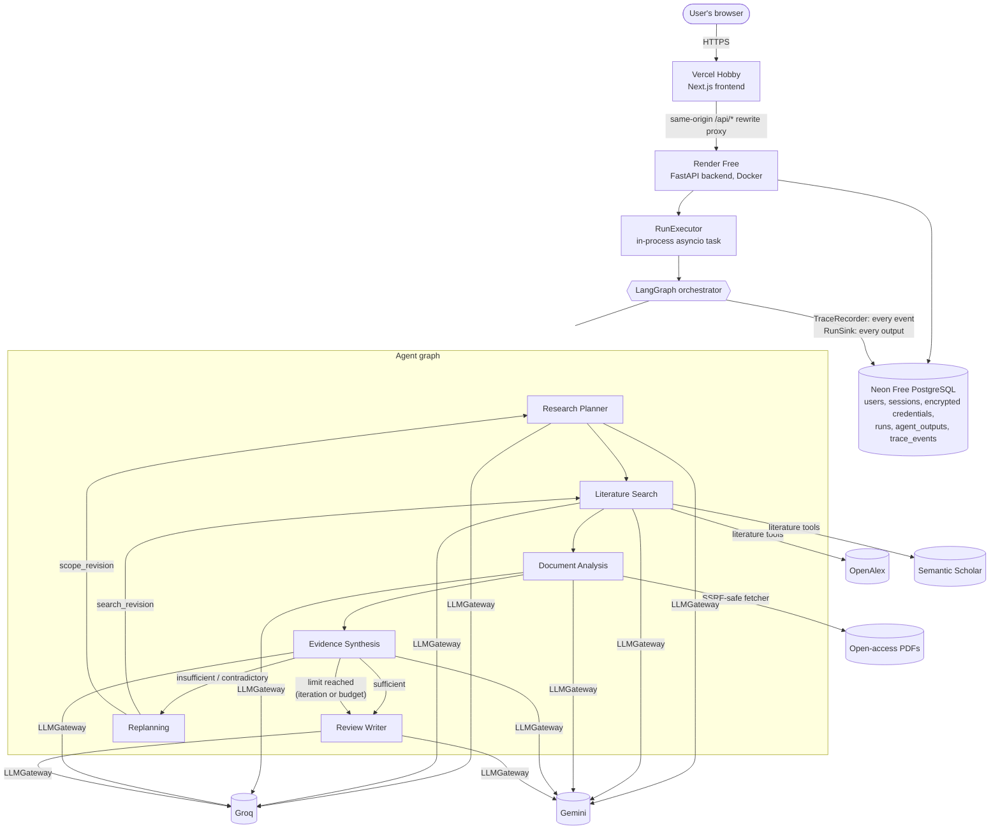

# ResearchPilot: Final Architecture

This document describes the system **as implemented and deployed**. [PHASE1_ARCHITECTURE.md](PHASE1_ARCHITECTURE.md) is the original design; the places where the implementation differs from it are listed in [§20](#20-differences-from-the-phase-1-design). The agent internals are in [PHASE6_MULTI_AGENT.md](PHASE6_MULTI_AGENT.md) and the Runs API is in [PHASE7_RUNS_API.md](PHASE7_RUNS_API.md).

## 1. System overview

ResearchPilot turns a research question into a cited literature review. Five specialised agents run as nodes of a **LangGraph `StateGraph`**. They exchange **versioned, validated Pydantic contracts**; they never exchange free-form chat. After every research round, **Evidence Synthesis** judges the evidence and, when it is not good enough, **routes the run back** for a revised search (to Literature Search) or a revised scope (to the Research Planner). The loop is bounded by an iteration limit and an LLM call/token budget. Every step is written to an **append-only trace** that the UI renders live.

## 2. Architecture diagram

The diagram is **not a fixed pipeline**: the path after Evidence Synthesis is chosen at run time from the synthesis decision and the remaining budget.

## 3. Agent architecture

Each agent is its own class (`backend/app/agents/`) with its own prompt, its own LLM output schema and its own output contract. `agents/base.py` is shared plumbing only: gateway calls with traced provider fallback, budget checks, and an `llm_call` trace event for every attempt. Code, not the LLM, enforces what must be exact: quote grounding, coverage counts, plan versions, citation keys and references.

## 4. Agent responsibilities

| Agent (graph node) | Input | Reasoning / decision | Tools | Output | Possible handoff | Adaptation |
|---|---|---|---|---|---|---|
| **Research Planner** (`planner`) | `ResearchRequest` (+ previous plan and a scope-revision `ReplanningRequest`) | Objective, 2–6 prioritised sub-questions, keywords, search strategy, inclusion/exclusion criteria | none (LLM only) | `ResearchPlan` (version set by code) | → Literature Search | On a scope revision, writes plan v+1 with a required `revision_reason` |
| **Literature Search** (`literature_search`) | `ResearchPlan` (+ search-revision `ReplanningRequest`, already-seen paper IDs, previous queries) | Plans queries per sub-question, refines once if too few new candidates, screens ≤ 40 pre-ranked candidates in one batched call | `literature_search` (OpenAlex + Semantic Scholar, dedupe, ranking) | `SearchRequest`, `SearchResults` (≤ 6 selected papers) | → Document Analysis | Runs the synthesis directives' queries first and excludes papers already seen |
| **Document Analysis** (`document_analysis`) | Selected `CandidatePaper`s | Per paper: methods, context, findings, limitations, evidence claims with **verbatim quotes** | `retrieve_document` (open-access PDF → pypdf, abstract fallback) | One `DocumentAnalysis` per paper | → Evidence Synthesis | Falls back to the abstract or metadata; drops ungrounded quotes and retries once; a failing paper is isolated |
| **Evidence Synthesis** (`evidence_synthesis`) | Plan + all analyses + previous verdicts | Code computes coverage; the LLM proposes a verdict, themes, contradictions and a replanning proposal; the **deterministic validator** accepts or overrides | none (LLM + rules) | `SynthesisDecision` (+ `ReplanningRequest` when not sufficient) | → Replanning, or → Review Writer | Drives the loop: search revision, scope revision or stop |
| **Review Writer** (`review_writer`) | Request, plan, final decision, all evidence, paper metadata, stop reason | Structured review prose with `[@Pn]` citations | none (LLM only) | `FinalReview` | → end | Marks the review `limited` or `contradictory` and always states its limitations; invented citation keys get one retry |

The **replanning node** (trace agent `orchestrator`) is not an LLM agent. It increments the iteration, records a `replan` event and routes to Search or the Planner.

## 5. Inter-agent communication: structured contracts

Agents communicate only through typed contracts held in LangGraph state (`backend/app/schemas/contracts/`). The contracts are immutable, reject unknown fields, and carry a `schema_version`.

| Contract | Produced by | Consumed by | Decision it enables |
|---|---|---|---|
| `ResearchRequest` | User (API) | Planner | Question, iteration cap (1–3), year range |
| `ResearchPlan` | Planner | Search, Synthesis, Writer | Which sub-questions must be answered (priority 1 is required for sufficiency) |
| `SearchRequest` | Search (internal) | Search tools | Which queries and filters run, and which papers are excluded |
| `SearchResults` | Search | Analysis | Which ≤ 6 papers are analysed this iteration |
| `DocumentAnalysis` | Analysis | Synthesis, Writer | Grounded `EvidenceItem`s per sub-question, with basis (full text, abstract or metadata) |
| `EvidenceSet` | Synthesis | Synthesis validator | Evidence grouped per sub-question (validated contract; not persisted as an output) |
| `SynthesisDecision` | Synthesis | Router, Writer | `sufficient` / `insufficient` / `contradictory`, coverage, contradictions, validator override |
| `ReplanningRequest` | Synthesis | Replanning → Search or Planner | `search_revision` (with query directives) or `scope_revision` (with `scope_change`); `check_against()` ensures every reason is backed by the decision |
| `FinalReview` | Writer | API / UI | Sections, `[@Pn]` citations, references built from metadata, limitations, evidence status |

## 6. LangGraph orchestration

`backend/app/orchestration/graph.py` builds the graph with nodes `planner`, `literature_search`, `document_analysis`, `evidence_synthesis`, `replanning` and `review_writer`. Conditional edges read the route computed by the pure functions in `routing.py`:
- After synthesis: `writer`, `replanning` or `limit_reached`.
- After replanning: `search_revision` or `scope_revision`.

`run_research()` (`runner.py`) records `run_started`/`run_completed`, applies the recursion limit (40) and the 20-minute timeout, and returns a structured final state.

## 7. Adaptive replanning

1. Synthesis computes coverage per sub-question **in code**: *covered* means ≥ 2 papers including ≥ 1 full text; *weak* means fewer; *missing* means none.
2. The validator (`validation.py`) requires all of the following for `sufficient`:
   - ≥ 2 papers with evidence
   - ≥ 3 evidence items
   - every priority-1 sub-question covered
   - no missing sub-question
   - no unresolved priority-1 contradiction

   Otherwise it overrides the LLM's verdict, and the override is traced.
3. Routing:
   - `sufficient` goes to the Writer.
   - Otherwise, if another iteration is allowed and affordable, the run goes to **Replanning**.
   - Otherwise the result is `limit_reached` (`iteration_limit` or `budget_limit`), which also goes to the Writer.
4. A **search revision** sends Search the synthesis directives and the IDs of papers already seen. A **scope revision** sends the Planner a `scope_change` and produces plan v+1.

Evidence that this happens is in [§21](#21-real-execution-evidence).

## 8. State flow

`ResearchState` (`state.py`) is a TypedDict holding research data only:
- request, iteration, current plan
- append-only histories of plans, searches, analyses, decisions and replans
- papers seen, route, stop reason, review, status and errors

The gateway (which can decrypt keys), the tools and the recorder live in `ResearchRuntime` and are bound to the nodes, never to state, so secrets can never be serialised or traced.

## 9. Tool architecture (`backend/app/tools/`)

These tools are deterministic and make no LLM calls.
- **Literature:** OpenAlex (primary) and Semantic Scholar (secondary), queried in parallel and normalised into one `Paper`.
  - Deduplication uses exact keys only: DOI, then provider IDs, then title + year + first author.
  - Ranking is transparent and explained per signal.
  - Bounds: ≤ 25 results per source, ≤ 40 combined.
  - If one source fails the result is marked degraded; only if both fail is `LiteratureUnavailable` raised.
- **Documents:** `retrieve_document()` returns `full_text`, `abstract_only` or `unavailable`, with a reason.
  - Only provider-reported open-access PDF URLs are fetched.
  - `SafePdfFetcher` checks every redirect hop: http(s) only, public IPs only, no https → http downgrade, PDF signature, ≤ 15 MB, 30 s.
  - pypdf runs in a worker thread with a 20 s deadline, ≤ 40 pages.
  - PDFs are held in memory only.

## 10. LLM provider architecture (`backend/app/llm/`)

- `LLMGateway` is the single entry point. Groq and Gemini are called through REST adapters behind one `LLMProvider` protocol.
- **Structured output:** JSON mode, Pydantic validation, and one repair round that feeds back field errors without echoing the submitted values.
- **Retries:** ≤ 2 transient retries with backoff, honouring `Retry-After`.
- **Rate limits:** per-provider RPM pacing.
- **Role preferences:** Groq for planning, search and analysis; Gemini for synthesis and writing. Each role falls back to the other provider, up to 3 candidates, and every fallback is traced.
- **Configuration:**
  - Model IDs are configuration (`GROQ_MODELS`, `GEMINI_MODELS`).
  - Reasoning budgets are configuration too (`GROQ_REASONING_EFFORT`, `GEMINI_THINKING_LEVEL`).
  - Each user's own key is decrypted per request through the credential service.

## 11. Database architecture

PostgreSQL 17 (Neon in production, Docker locally), SQLAlchemy 2 async + asyncpg, Alembic migrations `0001`–`0003`.

| Table | Contents |
|---|---|
| `users` | Normalised email, Argon2id hash |
| `sessions` | SHA-256 of an opaque token, expiry, revocation |
| `user_provider_credentials` | Fernet ciphertext, last-4 hint, status (`unverified`/`valid`/`invalid`) |
| `runs` | Owner, question, request, status, iteration, stop reason, safe error, LLM call/token counters, timestamps |
| `agent_outputs` | Each contract produced, per agent and iteration (JSONB, versioned) |
| `trace_events` | Append-only (a trigger blocks UPDATE and direct DELETE), gap-free `seq` per run, FK to `runs` (added `NOT VALID` in `0003`) |

## 12. Authentication architecture

- Email and password, with **Argon2id** hashing.
- Login creates a 256-bit opaque session token. Only its hash is stored, and the token travels only in the `rp_session` cookie: `HttpOnly`, `SameSite=Lax`, `Secure` in production, sliding 7-day expiry.
- Login returns the same 401 for an unknown email and a wrong password, and runs a dummy hash for timing parity.
- Every data query is scoped to the current user. Another user's run is a **404**, never a 403.

## 13. Trace architecture

- **Write path:** `TraceRecorder.record()` is the only one. Each event is sanitised, validated (`TraceEventIn`) and appended with a gap-free `seq`.
- **Event types:**
  - `run_started` and `run_completed`
  - `agent_started` and `agent_completed` (with `output_ref` pointing to the persisted output)
  - `llm_call` (metadata only, never prompts)
  - `tool_call`, `validation`, `decision`, `handoff`, `replan`, `fallback` and `error`
- **Parenting:** child events carry `parent_id` = their node's start event.
- **Reading:** `GET /api/runs/{id}/events?after=<seq>` is the polling cursor, and the frontend derives its timeline purely from these events.

## 14. Frontend / backend architecture

- **Next.js 16 (App Router, TypeScript strict)** on Vercel. The browser calls only same-origin `/api/*`, which the Next.js rewrite proxies to `BACKEND_URL`. This keeps the session cookie first-party and needs no CORS.
- **Polling:**
  1. `GET /runs/{id}`, then `/events?after=<last seq>`, every 2 s (10 s while the tab is hidden), with exponential backoff on connection loss.
  2. Outputs are re-read only when a new `agent_completed` event references one.
  3. On a terminal status: `/result` and `/outputs` are fetched once, and polling stops.
- **Pages:** landing, sign in and register, new research, history, run detail (Overview / Execution / Evidence / Review / Agent outputs), and settings.
- **Rendering:** the review's Markdown is rendered to React elements, never raw HTML.
- **Cold starts:** the waking screen probes `/api/readyz` and shows elapsed time only.

## 15. Deployment architecture

| Part | Service | Configuration |
|---|---|---|
| Frontend | **Vercel Hobby**: https://researchpilot-rho.vercel.app | Root `frontend`; one variable, `BACKEND_URL` (read at build time) |
| Backend | **Render Free** web service, Docker (`backend/Dockerfile`), Singapore: https://researchpilot-api-78oo.onrender.com | Health check `/healthz`; one uvicorn process on Render's `PORT` |
| Database | **Neon Free** PostgreSQL 17, AWS ap-southeast-1, direct endpoint | URL ending `?ssl=require` |

- **Migrations:** run from a developer machine with `uv run alembic upgrade head`, with `DATABASE_URL` set only in that shell, because Render Free has no pre-deploy step.
- **Environment categories:**
  - database URL
  - credential encryption key (production-only)
  - environment and cookie security
  - frontend origin
  - model lists and reasoning budgets

  Exact names are in the [README](../README.md#production-deployment-free-tiers). No provider keys are set as environment variables anywhere.
- **Endpoints:** `/healthz` (liveness, no database) and `/readyz` (`SELECT 1`, 503 on failure), also under `/api`.

## 16. Security boundaries

- **Secrets stay server-side.**
  - Provider keys are encrypted with **MultiFernet** (key rotation is supported). They are write-only from the client: only the last 4 characters are ever returned.
  - Keys are decrypted per request inside the adapter. They are never put in graph state, contracts, traces, logs or responses.
- **Redaction:**
  - The trace sanitiser removes credential-like keys and values: Authorization, cookies, `api_key`, tokens, Bearer values, Groq/Google key patterns, Fernet tokens, Argon2 hashes, passwords in URLs, and credential query parameters.
  - The 422 handler never echoes submitted input.
  - HTTP log records drop query strings.
- **Requests:**
  - **CSRF:** state-changing requests must come from `FRONTEND_ORIGIN` (403 otherwise), alongside `SameSite=Lax`.
  - **SSRF:** the PDF fetcher validates every redirect hop and allows public IPs only.
  - **HTTPS:** Vercel redirects HTTP → HTTPS (308) and sends HSTS (2 years, preload).
- **Repository:** gitleaks scans git history in CI, and `.env` files are git-ignored.

## 17. Error handling

| Failure | Behaviour |
|---|---|
| Provider rate limit (429) or timeout | ≤ 2 retries honouring `Retry-After`, then fallback to the next model or provider (traced `fallback`) |
| Provider rejects the key (401/403) | The key is marked `invalid`; the run falls back to another provider or fails with `auth_failed` |
| Malformed model output | One repair round with the field errors; then `structured_output_invalid` |
| PDF missing, too large, malformed or scanned | Abstract-only analysis (confidence capped at 0.6); no abstract means metadata-only with no LLM call |
| One paper's analysis fails | `AgentFailure` + `error` event; the other papers continue |
| One literature source down | Search is marked degraded; only if all sources fail is the error fatal |
| Ungrounded quote | Dropped and counted (`ungrounded_dropped`); one retry for that paper |
| Writer fails after a synthesis exists | Run is `partial`; the result carries the last synthesis |
| Fatal error (no provider, planner/synthesis failure) | `error` event, failed `agent_completed`, run `failed` with a safe `{code, message, node}` |
| Iteration or budget limit | `limit_reached` → Writer → `completed_with_limitations` with stated limitations |
| User cancels | Run `cancelled`; everything recorded so far is kept |
| Backend restart mid-run | Startup sweep marks queued/running runs `failed: interrupted` |

## 18. Resource and budget limits (`ResearchLimits`)

- ≤ 3 iterations.
- Per iteration: ≤ 6 papers, ≤ 6 search tool calls and ≤ 3 search LLM steps.
- ≤ 15 papers per run.
- Analysis concurrency 2, with a 16k-character excerpt per paper.
- **60 LLM calls / 200k tokens per run**, with 4 calls reserved for the Writer. The budget is never reset by replanning.
- Recursion limit 40, 20-minute run timeout.
- One concurrent run per process (`MAX_CONCURRENT_RUNS=1`) and one active run per user.

## 19. Free-tier constraints

| Constraint | Effect | Why it's acceptable |
|---|---|---|
| Render Free sleeps after ~15 min idle | First request takes ~30–60 s; the UI shows a waking screen. A run whose tab is closed can be cut off if the instance sleeps. | Live polling keeps the instance awake while a user watches; runs take minutes |
| In-process execution, no queue | A restart marks running runs `failed: interrupted` | The no-Redis/Celery constraint; failures are explicit, never silent |
| Groq free TPM (8K on gpt-oss) | Many 429s during document analysis, handled by retries and fallbacks; rejected attempts count toward the 60-call budget | Bounded, traced and visible; can end a run with `budget_limit` |
| Model churn | Free models get retired (e.g. `gemini-2.5-*` during development) | Model IDs are configuration, not code |
| Neon Free | Limited compute and connections | Small pool (5 + 5), one process |
| Literature APIs | Semantic Scholar's public pool is often rate-limited | Search degrades to OpenAlex; an optional free key is supported |

## 20. Differences from the Phase 1 design

| Phase 1 plan | Implemented |
|---|---|
| Tailwind, TanStack Query, Radix, OpenAPI-generated types | Plain CSS design tokens, a small typed fetch client, hand-written types mirroring the backend schemas (no new dependencies) |
| Vitest + React Testing Library + one Playwright smoke test | Node's built-in `node:test` with `tsc` and `react-dom/server`; **no Playwright** (it would add a dependency) |
| respx for HTTP mocking | `httpx2.MockTransport` |
| Official `groq` / `google-genai` SDKs | Provider REST APIs via `httpx2` (fewer dependencies, full control over headers and errors) |
| `generate_with_tools` (native tool calling) | Not needed: Search uses a planned/refined query loop |
| `api_credentials` table | `user_provider_credentials` |
| Fuzzy quote matching ≥ 0.9 | Normalised exact substring matching (stricter) |

## 21. Real execution evidence

Unedited exports produced by the live system are kept in [`docs/traces/`](traces/):

| Run | Where | Path taken | Outcome |
|---|---|---|---|
| [`34908068`](traces/2026-10-07_run-34908068.json) | local stack | Planner → Search → Analysis → Synthesis (*insufficient*) → **Replanning (search revision)** → Search → Analysis → Synthesis (*insufficient*) → **limit reached (budget)** → Writer | `completed_with_limitations`, 2 iterations, 125 events, 48 LLM calls |
| [`d29bb92b`](traces/2026-10-07_run-d29bb92b.json) | local stack (started from the Phase 8 UI) | Planner → Search → Analysis → Synthesis (*insufficient*) → **Replanning (search revision)** → Search → Analysis → Synthesis (***sufficient***) → Writer | `completed`, 2 iterations, 120 events, 44 LLM calls |
| `9403b69c` | **production** | Planner → … → Synthesis (*insufficient*) → **Replanning ×2 (search revisions)** → … → Synthesis (*insufficient*, **limit reached: iterations**) → Writer | `completed_with_limitations`, 3 iterations, 41 LLM calls (recorded from the production UI; no JSON export, because only the owner's session can read it) |

The **contradictory → scope revision → Planner (plan v2)** path is demonstrated by **automated graph tests** with a scripted LLM (`backend/tests/test_research_graph.py`), not by a real run; none of the real runs produced a contradictory verdict.
