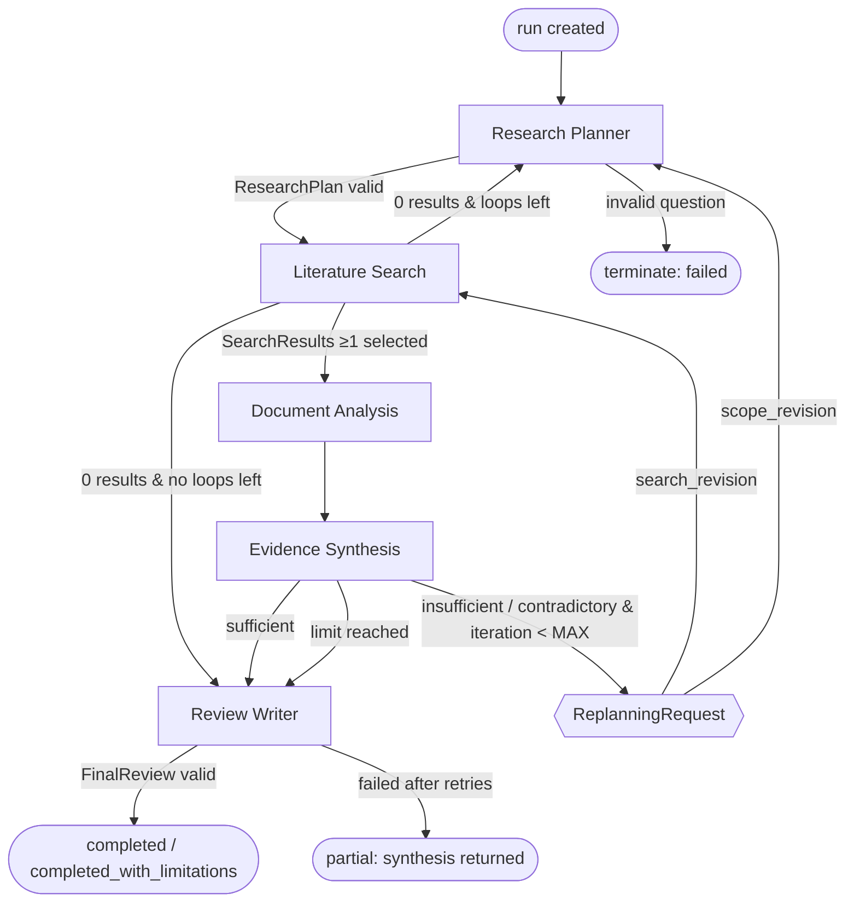
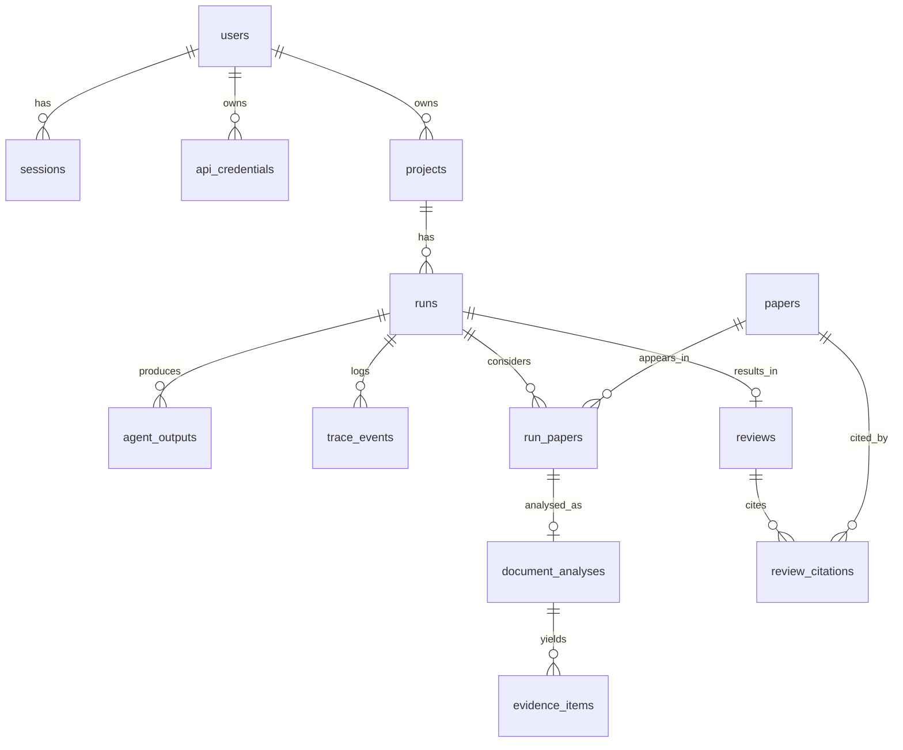
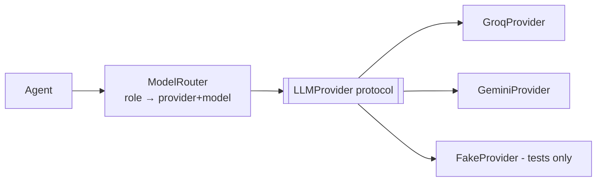
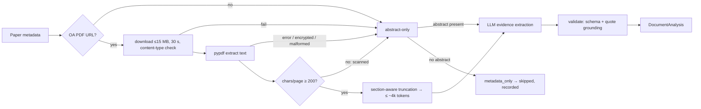
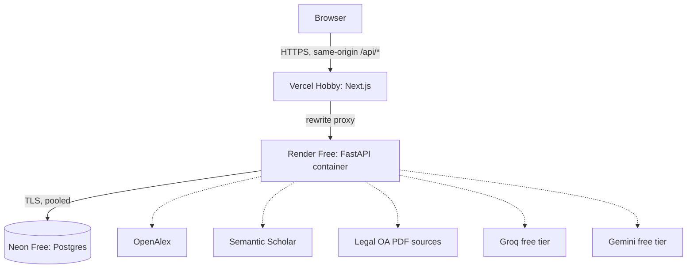

# ResearchPilot: Phase 1 Architecture and Technology Selection

Status: **Approved for implementation** (only the ownership split needs team input, see §18).
Scope: architecture only. Nothing here has been implemented yet.
**Hard constraint:** free tiers / free access only (see Cost Constraint).

---

## 0. Decision Summary

| Area | Decision |
|---|---|
| Orchestration | **LangGraph** `StateGraph` with typed state, conditional edges, bounded loop, and custom trace recorder |
| Backend | **Python 3.12 + FastAPI**, Pydantic v2, SQLAlchemy 2 (async) + asyncpg, Alembic, httpx; dependencies managed with **uv** |
| Run execution | In-process asyncio background task per run, 1 concurrent run (Render Free resources). State is persisted to Postgres. The UI polls the trace (no Redis or Celery) |
| Frontend | **Next.js (App Router) + TypeScript + Tailwind CSS**, TanStack Query, types generated from the backend OpenAPI schema |
| Database | **Neon PostgreSQL**: relational core plus JSONB for versioned agent outputs |
| Auth | Backend-owned email/password (Argon2id) and opaque DB sessions in an httpOnly cookie, kept same-origin through a Vercel rewrite proxy |
| User API keys | Fernet (`MultiFernet`) encryption at rest with a server master key. Write-only from the client. Validated on save |
| LLM layer | Own `LLMProvider` protocol with Groq and Gemini adapters. Provider and model are chosen per agent role, with fallback. Works on **free-tier keys** for Groq only, Gemini only, or both. Per-run LLM budget (§6.1) |
| Literature | **OpenAlex** (primary) + **Semantic Scholar** (secondary). The arXiv PDF URL is used only when OpenAlex or S2 return one |
| PDF | httpx download (size/time limits) → **pypdf** extraction → abstract-only fallback |
| Tracing | Own append-only `trace_events` table, exportable as JSON. LangSmith is not used |
| Testing | pytest, pytest-asyncio, respx, scripted fake LLM, real Postgres; Vitest + React Testing Library; one Playwright smoke test |
| Docker | Backend image (for deployment) + local Postgres via Compose. Frontend is not containerised |
| Deploy | **Vercel Hobby** (frontend), **Render Free** (backend), **Neon Free** (DB) |

---

## Cost Constraint

The implementation, development workflow, CI and CA3 deployment use **only free tiers or free access**. No paid subscription, paid plan or billing-enabled API is required, and none of the tiers below should be upgraded for this project. Free does not mean unlimited. The limits below are real, and the design (§6.1, §16) stays within them. Limits change, so each one is re-checked against the provider's current page when the related phase is implemented.

| Service | Tier | Relevant limits (approximate, subject to change) | Design response |
|---|---|---|---|
| Vercel | Hobby (free, non-commercial) | Bandwidth/request quotas; external rewrites proxied with a timeout | Static/SSR frontend, short polling requests only |
| Render | Free web service | 512 MB RAM, 0.1 CPU. Spins down after 15 min without inbound traffic, ~1 min wake. Monthly free instance hours. Ephemeral filesystem. No pre-deploy command. May restart at any time | 1 concurrent run, small memory footprint, migrations on start, cold-start UX (§16.1), interrupted-run sweep |
| Neon | Free | Small storage (~0.5 GB/project), limited monthly compute; compute scales to zero when idle (sub-second resume) | No PDFs/full text stored, compact JSONB, pooled connections |
| Groq API | Free tier | Per-model RPM / TPM / requests-per-day / tokens-per-day | Per-provider rate limiter, per-run token budget, compact prompts |
| Gemini API | Free tier | Per-model RPM / TPM / requests-per-day. Free-tier prompts may be used by Google to improve products (shown to users in key settings) | Same as Groq |
| OpenAlex | Free access (polite pool email or free API key, per current policy) | Daily request allowance | ≤ ~30 requests per run |
| Semantic Scholar | Free; optional API key obtainable free via request form | Shared low limit without key; ~1 req/s with key | Optional source: the app works without a key, just degraded |
| GitHub + Actions | Free (unlimited minutes for public repos; monthly quota for private) | Minutes on private repos | Short CI; no LLM calls in CI |
| Tooling | Open source (LangGraph MIT, pypdf BSD, gitleaks CLI MIT, Playwright, uv) | — | LangSmith/LangGraph Platform **not used** |

Items that could unexpectedly cost money, and the free alternative used:
- **`gitleaks-action` on GitHub** needs a license for organization-owned repos. Use the free **gitleaks CLI binary** in the workflow instead.
- **Transactional email** (verification/password reset) needs a mail service. It is **out of scope**: no email flows. Password change works when logged in.
- **Custom domain:** use the default `*.vercel.app` / `*.onrender.com` domains.
- **Error monitoring / LangSmith / Redis / workers:** not used. Structured logs and our own trace table are enough.
- **Docker Desktop:** free for personal/educational use. A native PostgreSQL install is an equal alternative for local development.
- **Paid academic APIs** (Scopus, Web of Science, etc.): not used.

---

## 1. Agent Orchestration

| Candidate | Advantages | Disadvantages | Project / CA3 impact |
|---|---|---|---|
| **LangGraph** | Explicit state graph, conditional edges, cycles, typed state with reducers, recursion limit, no LLM-vendor lock-in (we can call our own provider layer), mature | Learning curve. A graph can look like a "fixed pipeline" if routing isn't driven by agent decisions | The graph *is* the architecture diagram, and the loop and routing are visible and defensible. Strong for CA3 A and B |
| CrewAI | Fast to prototype role-based agents | Control flow is implicit and loops/routing are hard to bound precisely. Opinionated prompts | Hard to prove *why* a loop happened. Weak tracing control |
| AutoGen | Conversational multi-agent patterns | Chat-style coordination is non-deterministic and hard to bound or test. API churn between versions | Adaptive but hard to test and to explain in a demo |
| Agno | Lightweight, fast | Smaller ecosystem. Graph/loop semantics are less explicit | Little benefit over LangGraph for this flow |
| Custom orchestrator | Full control, zero dependencies | We would re-build state merging, routing, and loop guards, and it is easy to drift into an `if/else` pipeline | More code and risk. Evaluators may see it as a hard-coded workflow |

**Recommendation: LangGraph (1.x), used narrowly.** We use only `StateGraph`, nodes, conditional edges and reducers. We do **not** use LangChain chat-model wrappers, LangSmith, or LangGraph prebuilt agents. Agents call our own `LLMProvider` (§6) and tool registry.
**Justification:** it gives the cycles, conditional routing and bounded recursion we need, and it keeps every agent a plain, testable async function.

### Why this is agentic rather than a renamed pipeline
- **Routing is decided by agent output.** Edges read the Evidence Synthesis Agent's `SynthesisDecision`, not a step counter.
- **Agents run bounded internal reasoning loops with tool choice.** The Search Agent chooses sources and queries, inspects result counts, and refines its queries (§7). The Analysis Agent chooses between full text and the abstract.
- **Validators can overrule agents.** For example, a "sufficient" claim that fails the coverage rules is downgraded, and that is traced.
- **Replanning carries reasons.** Each loop is driven by a `ReplanningRequest` naming the gaps and contradictions, and the Planner can be re-invoked for scope changes.

### Graph



### How Evidence Synthesis sends the process back
1. Synthesis emits a `SynthesisDecision` with `verdict ∈ {sufficient, insufficient, contradictory}`, per-sub-question coverage, and the gaps and contradictions it found.
2. A deterministic **sufficiency validator** checks that verdict against coverage rules (§12). If the LLM says "sufficient" but the rules fail, the verdict is downgraded and a `validation` trace event records why.
3. If the verdict is not `sufficient` and `state.iteration < MAX_RESEARCH_ITERATIONS` (3), Synthesis also emits a `ReplanningRequest`, which is appended to state and traced as a `replan` event:
   - `kind=search_revision` → targeted queries, filters such as year range or study type, and paper IDs to exclude → routed to **Literature Search**.
   - `kind=scope_revision` → the question is too broad or narrow, or a sub-question is unanswerable → routed to the **Planner**, which issues a new `ResearchPlan` version.
4. The `route_after_synthesis(state)` conditional edge reads only `state.synthesis_decisions[-1]` and `state.iteration`. This makes it pure and unit-testable.
5. When the limit is reached, the run goes to the Writer with `limitations` populated. The final review states that the evidence was insufficient or contradictory. The run never loops indefinitely, and LangGraph's `recursion_limit` is set as a second guard (≈ 40 steps).

---

## 2. Backend

| Candidate | Pros | Cons | Verdict |
|---|---|---|---|
| **Python + FastAPI** | Best AI/PDF/HTTP library ecosystem, native async, Pydantic schemas double as agent contracts and OpenAPI | Python async discipline is required | **Chosen** |
| Python + Django | Batteries-included auth/admin | Its sync-first ORM is awkward for long async agent runs. Heavier | Rejected |
| Node/TypeScript (Next.js API or Nest) | One language end to end | Weaker PDF/scientific tooling. LangGraph.js lags the Python version. Vercel function time limits | Rejected |

**Architecture:**
- **FastAPI** routers: `auth`, `credentials`, `projects`, `runs`, `health`.
- **Run execution:** `POST /runs` validates the input, inserts a `runs` row (`queued`) and returns `202`. A background asyncio task executes the graph. A per-process semaphore limits concurrent runs (default **1**, sized for Render Free's 512 MB / 0.1 CPU; extra runs stay `queued`), and each user can have **1 active run**.
  - On startup, runs left in `running` from a crashed process are marked `failed (interrupted)`.
  - Celery/Redis is intentionally omitted. Runs take minutes, not hours, and one backend instance is enough for CA3.
- **Progress:** the client polls `GET /runs/{id}/events?after={seq}` every ~2 s. Polling is simpler and more robust than SSE through the Vercel proxy, and the trace becomes the progress feed.
- **DB:** SQLAlchemy 2 async + asyncpg, with Alembic migrations.
- **HTTP clients:** a shared `httpx.AsyncClient` with timeouts and retry via `tenacity`.
- **Config:** `pydantic-settings`, read from env only.
- **Logging:** structured JSON logs (stdlib `logging` + JSON formatter) with a redaction filter for keys, cookies, and `Authorization` headers.

---

## 3. Frontend

| Candidate | Pros | Cons | Verdict |
|---|---|---|---|
| **Next.js (App Router) + TS** | First-class on Vercel, routing, server components for auth gating, `rewrites` proxy gives a same-origin API | Framework complexity | **Chosen** |
| React SPA (Vite) + TS | Simplest mental model | Needs separate routing. No same-origin proxy unless one is configured elsewhere | Viable fallback |

**Stack:** Next.js + TypeScript (strict), Tailwind CSS with custom design tokens, and headless accessible primitives (Radix) chosen in the frontend phase. We avoid a default-styled component kit so the UI doesn't look like a generic dashboard. Other choices:
- TanStack Query handles server state and polling.
- `openapi-typescript` generates API types from FastAPI's schema, so contracts can't drift.
- Rendered review: Markdown → sanitised HTML (`react-markdown` + `rehype-sanitize`).

Visual design is deferred to the frontend phase.

Key screens: auth; API-key settings; project list; new research question; run view (live agent timeline/trace, iterations, papers, evidence); final review with references; trace export.

---

## 4. Database and Data Model (Neon PostgreSQL)



| Table | Key columns | Notes |
|---|---|---|
| `users` | id (uuid), email (unique, citext), password_hash, created_at | |
| `sessions` | id, user_id, token_hash (sha256), expires_at, created_at, revoked_at | Opaque token; only the hash is stored |
| `api_credentials` | id, user_id, provider (`groq`/`gemini`), ciphertext, key_last4, status (`valid`/`invalid`/`unverified`), validated_at, created_at, updated_at | Unique (user_id, provider) |
| `projects` | id, user_id, title, created_at | Groups runs on related questions |
| `runs` | id, project_id, user_id, question, config (jsonb: max_iterations, provider prefs), status, iteration, stop_reason, error (jsonb), started_at, finished_at | Status: `queued, running, completed, completed_with_limitations, partial, failed, cancelled` |
| `agent_outputs` | id, run_id, agent, schema_name, schema_version, iteration, payload (jsonb), created_at | Every validated contract object (plan, search results, decision…); trace events reference these |
| `trace_events` | see §11 | Append-only |
| `papers` | id, doi (unique nullable), openalex_id, s2_id, arxiv_id, title, authors (jsonb), year, venue, abstract, oa_pdf_url, citation_count | Global cache keyed by canonical IDs |
| `run_papers` | run_id, paper_id, iteration_found, source(s), relevance_score, selection_status (`selected`/`rejected`/`excluded_duplicate`), selection_reason | |
| `document_analyses` | id, run_id, paper_id, basis (`full_text`/`abstract_only`/`metadata_only`), extraction_status, failure_reason, page_count, payload (jsonb) | |
| `evidence_items` | id, analysis_id, run_id, sub_question_id, claim, stance, quote, location, study_type, confidence | Queryable for synthesis and UI |
| `reviews` | id, run_id, markdown, sections (jsonb), limitations, provider, model, created_at | |
| `review_citations` | review_id, paper_id, citation_key | Only papers in the run's evidence |

**Persisted:** everything above. **Transient (memory only):** decrypted API keys, PDF bytes, full extracted text, raw prompts. Raw LLM responses are kept in trace error payloads only when validation fails, truncated to 2 KB. Not storing full text avoids copyright and storage issues, and the evidence quotes are enough to justify claims. Runs and their data are deleted when the user deletes the project (cascade).

---

## 5. Authentication and User API Keys

| Candidate | Pros | Cons | Verdict |
|---|---|---|---|
| **Backend-owned email/password + DB sessions** | One source of truth, easy to test, revocable sessions, no vendor | We implement hashing, sessions and rate limiting ourselves | **Chosen** |
| Auth.js (NextAuth) | OAuth easily | Auth lives in the frontend, so the backend must trust and verify a second system | Rejected |
| Clerk / Neon Auth / Supabase Auth | Managed, OAuth | External vendor and JWT verification plumbing. Less to "show" for CA3 | Rejected (could be revisited) |

**Auth design:**
- Passwords: **Argon2id** via `pwdlib`/`argon2-cffi`. Minimum length 10, and login is rate-limited per IP and email (in-memory limiter, which is enough for one instance).
- Session: 32-byte random token in the cookie `rp_session` (`HttpOnly; Secure; SameSite=Lax; Path=/`), with a 7-day sliding expiry. Only `sha256(token)` is stored in the DB. Logout revokes the session.
- **Same-origin:** Next.js `rewrites` proxies `/api/*` → backend, so the browser only talks to the Vercel origin and cookies are first-party. This avoids third-party cookie blocking.
- CSRF: `SameSite=Lax` plus an `Origin`/`Referer` check on state-changing requests.
- Authorization: every query is scoped by `user_id` from the session through a repository layer. Accessing another user's resource returns `404`.

**User API key design:**
1. The user submits the key once via `PUT /credentials/{provider}` over HTTPS. The key is **never returned** afterwards; only `key_last4`, status and validated_at are.
2. The backend validates it with a cheap authenticated call (the provider's list-models endpoint). The outcome is `valid` / `invalid` (401/403) / `unverified` (provider down; saved but flagged).
3. Encryption: `MultiFernet([current, previous...])` using `CREDENTIAL_ENCRYPTION_KEYS` from env. Master-key rotation works by re-encrypting with the newest key.
4. A key is decrypted only inside the run task and passed to the provider adapter via LangGraph's runtime config. It is **never placed in graph state**, so it is never serialized, traced or logged.
5. Rotation: `PUT` overwrites. Deletion: `DELETE /credentials/{provider}` removes the row immediately.
6. Invalid key mid-run (HTTP 401/403): mark the credential `invalid`, emit an `error` trace event, and fail over to the user's other provider if it is valid. Otherwise end the run as `failed` with code `LLM_KEY_INVALID` and a user-facing message.
7. Frontend: the key field is `type=password` with `autocomplete=off`. It is not stored in React Query cache, local storage or logs. The form is cleared after submit.
8. Git: only `.env.example` with placeholder names is committed, and `.gitignore` covers `.env*`. A secret scan (`gitleaks` in CI) is added in Phase 2.

---

## 6. LLM Abstraction



```text
LLMProvider (Protocol)
  name: "groq" | "gemini"
  async generate_structured(messages, schema: type[BaseModel], model, temperature, max_tokens) -> LLMResult[schema]
  async generate_with_tools(messages, tools: list[ToolSpec], model, ...) -> ToolCallStep | FinalMessage
LLMResult: parsed, raw_text, usage{in,out}, latency_ms, provider, model
```

- Adapters use the official SDKs (`groq`, `google-genai`) in JSON/structured-output mode. Output is always re-validated with Pydantic. On a validation error, one **repair retry** includes the validation message, and the second failure is raised as `AgentOutputInvalid`.
- **Per-agent provider/model is allowed**, through `ModelRouter` config: role → ordered list of (provider, model). Defaults:
  - Groq (fast) for Search query generation and per-paper Analysis, which are high-volume.
  - Gemini (long context) for Synthesis and Writer.
  - If the user has only one valid key, every role uses that provider.
- **Free-tier requirement (hard):** the app must work with free-tier Groq and/or Gemini keys and never require users to enable billing. Valid configurations are Groq only, Gemini only, or both. With one valid provider, every role uses it.
- **Model IDs are configuration, not code.** Each provider has an ordered candidate list in backend settings (env). When a key is saved, the backend calls the provider's list-models endpoint and keeps only candidates that are available to that key. The first available one is used per role, and the chosen model is recorded in the trace.
  - Candidate lists contain only models the provider documents as available on its free tier. They are chosen and verified in Phase 4 against the providers' current pages. No model with uncertain free availability is hard-coded.
  - Development and testing use the same free-tier models, and CI uses no real LLM at all.
- Errors are normalised into `ProviderAuthError`, `ProviderRateLimited(retry_after)`, `ProviderUnavailable`, `ProviderBadResponse`. Each LLM call emits an `llm_call` trace event with provider, model, tokens and latency, but no prompt text.

### 6.1 LLM Cost Control (free-tier budget)

All values are settings with these defaults. They are sized so a full 3-iteration demo run fits comfortably in one provider's free daily allowance.

| Bound | Default |
|---|---|
| Research iterations | max 3 |
| Search: LLM steps / tool calls per iteration | ≤ 3 LLM steps, ≤ 6 tool calls |
| Screening | 1 batched LLM call per iteration (≤ 40 candidates, abstracts truncated to 400 chars) |
| Papers analysed | ≤ 6 per iteration, ≤ 15 per run |
| Analysis input per paper | ≤ ~4k tokens of selected sections (no multi-chunk map-reduce by default) |
| Analysis concurrency | 2 (also paced by rate limiter) |
| Output tokens | Planner 1k, Search 600/step, Analysis 800, Synthesis 2k, Writer 3.5k |
| LLM retries per call | 1 repair (validation) + 2 transient, then provider fallback |
| LLM calls per run | hard cap 60 |
| Tokens per run | hard cap 200k (in + out), configurable |

**Behaviour:**
- **Rate limiting:** a per-provider async limiter enforces configured RPM/TPM before calling, so we wait rather than hit 429s. Transient 429s honour `Retry-After` (waits ≤ 60 s).
- **Daily quota exhausted** (a 429 identifying a daily limit): switch to the other provider if it is valid. Otherwise finish gracefully, as below.
- **Budget guard:** ~15% of the token budget is reserved for the Writer. If the remaining budget can't cover another iteration, the router skips replanning, goes to the Writer with `stop_reason=budget_limit`, and the review states its limitations.
- **No redundant calls:** papers already analysed are never re-analysed. Deterministic work (dedupe, coverage rules, reference formatting, quote grounding) is done in code, not by the LLM. Screening is batched.

---

## 7. Literature Search

| Source | Pros | Cons | Use |
|---|---|---|---|
| **OpenAlex** | Free, very broad (≈250M works), DOIs, OA locations (`best_oa_location.pdf_url`), filters (year, type, concepts), generous limits | Abstracts as inverted index (reconstruct), noisy relevance | **Primary** |
| **Semantic Scholar** | Good relevance ranking, `openAccessPdf`, TLDRs, citation counts | Low unauthenticated limits. A free API key (via request form, no payment) gives ≈1 req/s | **Secondary** |
| arXiv API | Preprint PDFs always available | Narrow domain coverage. 1 req / 3 s | Not searched directly; arXiv IDs/PDF links arrive via OpenAlex/S2 |
| Crossref | Authoritative DOI metadata | Weak for relevance search, rarely has abstracts | Rejected (OpenAlex already includes Crossref data) |
| CORE / Unpaywall | More OA full-text | Extra integration for marginal gain | Deferred; can be added as one more tool if PDF coverage is poor |

Only free/public access is used. Server-side app credentials such as `OPENALEX_EMAIL`/`OPENALEX_API_KEY` and `S2_API_KEY` are environment variables, not user keys, and are **obtainable without any paid subscription**. Both are optional: without them the app uses public access at lower limits. No paid academic API is introduced.

**Search Agent loop (bounded: ≤ 3 LLM steps and ≤ 6 tool calls per iteration):**
1. **Input:** `ResearchPlan` (iteration 1) or `ReplanningRequest` (later iterations).
2. The LLM produces queries per sub-question, then calls the tools `search_openalex(query, filters, limit)` and `search_semantic_scholar(query, fields, limit)`.
3. After each tool result the agent sees counts and top titles. It may refine the query when results are too few, too many or off-topic, or stop.
4. **Normalise and dedupe (deterministic):**
   - Key on DOI (lowercased, no URL prefix), else OpenAlex/S2/arXiv ID cross-references, else normalised title + year (title similarity ≥ 0.92 with `rapidfuzz`).
   - Merge metadata (prefer OpenAlex IDs and S2 abstract/TLDR), and exclude papers already analysed in earlier iterations.
5. **Screening:** the LLM scores each candidate's title and abstract against the plan's inclusion and exclusion criteria (score 0–1 + reason). Code selects the top `K_PER_ITERATION=6`, capped at `MAX_PAPERS_TOTAL=15`. It prefers papers with an OA PDF on ties.
6. **Failures:**
   - Per-source retry with backoff on 429/5xx, honouring `Retry-After`, with a maximum of 3 attempts.
   - If one source is down, the agent continues with the other and records `degraded_sources`.
   - If both are down, the agent fails with `LITERATURE_UNAVAILABLE`.
   - Zero results are reported upward (§12).
7. **Output:** `SearchResults` is persisted (`papers`, `run_papers`, `agent_outputs`) and appended to state.

---

## 8. Document / PDF Processing



- **Library:** **pypdf** (BSD, pure Python, no native build issues on Render). PyMuPDF extracts better but is AGPL and adds a native dependency. GROBID is excellent but needs a separate Java service, which is over-engineering for this project.
- **Only legal OA URLs** from OpenAlex/S2/arXiv are downloaded. We don't scrape publisher pages and don't bypass paywalls.
- **Large documents:**
  - Keep abstract, introduction, methods, results, discussion and conclusion, detected by heading regexes, and drop references and appendices.
  - Parse at most 40 pages, then keep the highest-value sections within the ~4k-token budget (§6.1). Chunked extraction is a disabled-by-default setting, to save free-tier quota and memory.
- **Scanned PDFs:** no OCR (cost and complexity). Fall back to the abstract and record `failure_reason=scanned_pdf`.
- **Grounding validation:**
  - Every `EvidenceItem.quote` must appear in the source text after whitespace/case normalisation (fuzzy ≥ 0.9). Ungrounded items are dropped and counted in a `validation` event.
  - If more than 50% are ungrounded, the extraction is retried once.
- Analysis runs per paper with bounded concurrency (2). One paper failing never fails the run.

---

## 9. Agent Message Contracts

All contracts are Pydantic v2 models in `backend/app/schemas/contracts/`. Each has `schema_version` and is persisted to `agent_outputs`. IDs are UUIDs, and `sq-n` identifies sub-questions.

```text
ResearchRequest (user → Planner)
  question: str (15–1000 chars), max_iterations: int = 3 (1..3), year_from?: int, year_to?: int

ResearchPlan (Planner → Search; versioned)
  plan_version: int
  objective: str
  sub_questions: [ {id: "sq-1", text, rationale, priority: 1..3} ]   # 2..6 items
  inclusion_criteria: [str] (≥1), exclusion_criteria: [str]
  keywords: [str] (≥3), year_range?: {from, to}, study_types?: [str]
  revision_reason?: str   # required when plan_version > 1
  validate: unique ids; every sub_question has ≥1 keyword-relevant term; year_from ≤ year_to
  failure: PLAN_INVALID (after repair retry) | QUESTION_REJECTED (not a research question)

SearchRequest (internal to Search Agent; derived from plan or ReplanningRequest)
  iteration, targets: [ {sub_question_id, queries: [str], filters} ], exclude_paper_ids: [uuid], k: int

SearchResults (Search → Analysis)
  iteration, queries_executed: [{source, query, filters, result_count}]
  candidates_total, duplicates_removed, degraded_sources: [str]
  selected: [ {paper_id, title, year, doi?, sub_question_ids, relevance_score, reason, has_oa_pdf} ]  # 0..K
  rejected_count
  validate: selected ⊆ persisted papers; no paper analysed in a prior iteration
  failure: LITERATURE_UNAVAILABLE | NO_RESULTS (not an exception: routed by graph)

DocumentAnalysis (Analysis → Synthesis; one per paper)
  paper_id, basis: full_text|abstract_only|metadata_only, extraction_status, failure_reason?
  study_type?: str, sample/context?: str, methods_summary?: str, limitations: [str]
  evidence: [EvidenceItem]
EvidenceItem
  id, sub_question_id, claim (≤400 chars), stance: supports|refutes|mixed|neutral,
  quote (≤600 chars, grounded), location?: "p.4"|section, confidence: 0..1
  validate: sub_question_id exists in current plan; quote grounded; confidence capped at 0.6 if abstract_only

EvidenceSet (assembled by Synthesis from state; persisted snapshot)
  iteration, by_sub_question: { sq-id: [evidence_item_id] }, paper_count, full_text_count

SynthesisDecision (Synthesis → router; Writer)
  iteration, verdict: sufficient|insufficient|contradictory
  coverage: [ {sub_question_id, supporting_papers, full_text_papers, status: covered|weak|missing} ]
  contradictions: [ {sub_question_id, claim_a: evidence_id, claim_b: evidence_id, explanation} ]
  themes: [ {title, summary, evidence_ids} ]
  rationale: str
  validator_override?: {original_verdict, rule_failed}
  validate: referenced ids exist; verdict consistent with coverage rules (§12)

ReplanningRequest (Synthesis → Search or Planner)
  iteration_from, kind: search_revision|scope_revision
  reasons: [ {type: gap|contradiction|low_quality, sub_question_id, detail} ] (≥1)
  directives: [ {sub_question_id, suggested_queries: [str], filters?: {year_range, study_types}} ]
  exclude_paper_ids: [uuid]
  validate: ≥1 directive for search_revision; each reason ties to a coverage/contradiction entry

FinalReview (Writer → API/UI)
  title, abstract, sections: [ {heading, body_markdown, citation_keys: [str]} ],
  limitations: [str], evidence_status: sufficient|limited|contradictory
  references: built by code from cited paper metadata (LLM never writes reference text)
  validate: every [@key] in body maps to a paper with evidence in this run; each content section cites ≥1;
            no uncited claims about specific numbers (heuristic warning only)
  failure: WRITER_FAILED → run status partial (SynthesisDecision themes returned as fallback)
```

| Agent | Consumes | Produces | Downstream |
|---|---|---|---|
| Research Planner | ResearchRequest, (ReplanningRequest scope) | ResearchPlan | Literature Search |
| Literature Search | ResearchPlan / ReplanningRequest | SearchResults | Document Analysis (or Planner if 0 results) |
| Document Analysis | SearchResults + paper metadata | DocumentAnalysis[] | Evidence Synthesis |
| Evidence Synthesis | plan + all evidence so far | EvidenceSet, SynthesisDecision, ReplanningRequest? | Router → Writer / Search / Planner |
| Review Writer | plan, SynthesisDecision, evidence, paper metadata | FinalReview | API / UI |

---

## 10. Shared State (LangGraph)

```text
ResearchState (TypedDict, Pydantic-validated at node boundaries)
  # immutable
  run_id, user_id, request: ResearchRequest, max_iterations
  # updated (latest wins; history kept in agent_outputs)
  plan: ResearchPlan
  iteration: int
  status: str
  # append-only (reducer = list concat)
  plans_history: [plan_output_id]
  search_results: [SearchResults]
  analyses: [DocumentAnalysis]
  synthesis_decisions: [SynthesisDecision]
  replan_requests: [ReplanningRequest]
  errors: [AgentError {agent, code, message, retryable, iteration}]
  # merged by key
  papers_seen: {paper_id: {iteration_found, analysed: bool}}
  # terminal
  review: FinalReview | None
Runtime config (NOT state, never persisted): decrypted keys, provider clients, http client, trace recorder
```

- **Persisted:** each node writes its validated output to `agent_outputs` and trace events before returning. State can therefore be reconstructed from the DB, and the UI never reads in-memory state.
- **Transient:** runtime config, PDF bytes, full text.
- **Explaining "why search again":** `replan_requests[i].reasons` links to `synthesis_decisions[i].coverage` and `contradictions`, which link to evidence IDs. The UI shows this chain, and the trace has a matching `replan` event that references both outputs.

---

## 11. Execution Trace

`trace_events` (append-only; never updated):

| Field | Type | Meaning |
|---|---|---|
| id | uuid | |
| run_id | uuid | |
| seq | int | Monotonic per run (unique (run_id, seq)), polling cursor |
| ts | timestamptz | |
| iteration | int | Research loop iteration |
| agent | enum | planner, search, analysis, synthesis, writer, orchestrator |
| event_type | enum | `run_started, agent_started, agent_completed, llm_call, tool_call, tool_result, validation, decision, handoff, retry, replan, fallback, error, run_completed` |
| status | enum | ok, warning, failed |
| parent_id | uuid? | Links tool/llm events to their agent_started event |
| input_ref / output_ref | uuid? | → `agent_outputs.id` |
| tool | jsonb? | {name, args (redacted), result_summary, duration_ms} |
| decision | jsonb? | {verdict/route, rationale, from, to} |
| validation | jsonb? | {schema, passed, errors[], dropped_items, override?} |
| llm | jsonb? | {provider, model, tokens_in, tokens_out, latency_ms, attempt} |
| error | jsonb? | {code, message, retryable, attempt} |
| message | text | One-line human summary |

- Emitted by a `TraceRecorder` that wraps every node, tool and LLM call (decorator/context manager), so agents can't forget to trace. Handoffs are emitted by the router (`handoff: synthesis → search, reason: replan#2`).
- **Redaction:** API keys and cookies never enter the trace. Tool args are allowlisted.
- **Export:** `GET /runs/{id}/trace` (JSON) and a "Download trace" button in the UI. For CA3, traces from **real runs** are exported into `docs/traces/` with the run date and config. They are never hand-written or edited.

---

## 12. Error Handling and Replanning

**Bounds:**
- `MAX_RESEARCH_ITERATIONS = 3` (initial + 2 replans; per-run override 1..3).
- `MAX_PLANNER_REVISIONS = 2`.
- Search: ≤ 3 LLM steps and ≤ 6 tool calls per iteration.
- LLM budget per run: 60 calls / 200k tokens (§6.1), with `stop_reason=budget_limit` handled like the iteration limit.
- LLM: 1 repair retry + 2 transient retries.
- LangGraph `recursion_limit = 40`.
- Run wall-clock timeout of 20 min (free-tier rate pacing makes runs slower) → `failed (timeout)`, keeping partial outputs.

**Sufficiency rules (deterministic validator):** a sub-question is `covered` if it has ≥ 2 distinct papers with relevant evidence, at least 1 of them full-text; `weak` if it has 1 paper or only abstract evidence; `missing` if it has none.
- `sufficient` requires every priority-1 sub-question `covered`, no `missing` sub-question, and no unresolved contradiction on a priority-1 sub-question.
- A contradiction counts as resolved when Synthesis explains it with a documented moderator such as population, method or time period.

| Failure | Strategy | Outcome |
|---|---|---|
| Invalid user input | Reject at API (422) and the Planner's `QUESTION_REJECTED` | No run / run `failed` with message |
| Invalid LLM key | Mark credential invalid → **fallback** to other provider if valid | Else terminate `failed` (`LLM_KEY_INVALID`) |
| LLM provider failure (429/5xx/timeout) | **Retry** with backoff (2) → **fallback** provider | Else agent error → terminate gracefully with partial outputs |
| Literature API failure | **Retry** (3) → continue with other source (`degraded_sources`) | Both down → `failed` (`LITERATURE_UNAVAILABLE`) |
| No search results | **Replan**: route to Planner (broaden keywords/years) if revisions remain | Else Writer with "no evidence found" limitations → `completed_with_limitations` |
| Duplicate papers | Deterministic dedupe (not an error), counted in SearchResults | — |
| PDF retrieval / extraction failure, scanned, malformed, too large | **Degrade** to abstract-only / metadata-only for that paper | Run continues; recorded per paper |
| All selected papers unusable | Synthesis sees zero evidence → `insufficient` → **replan** | Bounded as usual |
| Agent output validation failure | **Repair retry** with errors → second provider | Else agent error; critical agents (Planner/Synthesis) end run `failed`, Analysis drops that paper |
| Insufficient evidence | **Replan** via `ReplanningRequest(search_revision)` | Limit → Writer with limitations |
| Contradictory evidence | **Replan** with targeted queries (meta-analyses, recent studies, moderators) | Limit → Writer presents both sides as `contradictory` |
| Writer failure | **Repair retry** → fallback provider | Else run `partial`: synthesis themes + references returned |
| Process crash | Startup sweep | Run `failed (interrupted)`; outputs to that point remain |

---

## 13. Testing Strategy

**Backend: pytest, pytest-asyncio, respx (httpx mocking), real Postgres**
- **Schema tests:** every contract accepts valid data and rejects invalid data (missing fields, bad references, duplicate IDs, unknown sub-question).
- **Agent behaviour:** each agent runs against a `ScriptedLLMProvider` (returns pre-defined structured outputs and records the calls) and respx-mocked APIs. The tests assert real behaviour:
  - The Planner repairs invalid output on retry.
  - Search dedupes by DOI and by title and excludes analysed papers.
  - Analysis drops ungrounded quotes and falls back to the abstract on a corrupt PDF (a real malformed PDF fixture).
  - The Writer rejects unknown citation keys.
- **Orchestration:** the pure `route_after_*` functions get table-driven tests. A full-graph test with scripted outputs asserts the visited node sequence:
  - insufficient → search → analysis → synthesis → sufficient → writer.
  - The iteration cap forces the writer with limitations.
  - The scope revision goes to the Planner.
- **Sufficiency validator:** a coverage-rule matrix, including the case where an LLM "sufficient" verdict is overridden.
- **Failure handling:** 429 → retry, honouring `Retry-After`; one source down → degraded; invalid key → fallback/fail; timeout.
- **Trace:** a scripted run produces the expected ordered event types, `seq` is monotonic, and the trace contains no secrets (assert that a planted key string is absent).
- **Auth/credentials:** register/login/logout, session expiry, cross-user access returns 404, the key is never returned by any endpoint, and the encryption round-trip and rotation work.
- **DB:** repositories against real Postgres. The schema is created via Alembic migrations in the test DB, so migrations are tested too.
- **Live tests** (`@pytest.mark.live`, opt-in, need real keys, never in CI): one real end-to-end run. This is also how real traces for `docs/traces/` are produced.

**Frontend: Vitest + React Testing Library**
- Covered: key form never re-displays the key, run timeline renders events and polling stops on terminal status, error states, citation rendering.
- **Playwright:** one smoke flow against a local stack (login → submit question → see trace). This is an optional CI job.

**CI (GitHub Actions):** ruff + mypy (backend), eslint + tsc (frontend), pytest with a Postgres service container, vitest, and the gitleaks CLI (free; not the licensed GitHub Action). CI never calls real LLM or academic APIs, so it costs no quota.

---

## 14. Repository Structure (to be created in Phase 2)

```text
ResearchPilot/
├── backend/
│   ├── app/
│   │   ├── main.py                 # FastAPI app factory
│   │   ├── config.py               # pydantic-settings
│   │   ├── api/                    # routers: auth, credentials, projects, runs, health
│   │   ├── agents/                 # planner.py, search.py, analysis.py, synthesis.py, writer.py
│   │   ├── orchestration/          # graph.py, state.py, routing.py, runner.py
│   │   ├── tools/                  # openalex.py, semantic_scholar.py, pdf.py, dedupe.py
│   │   ├── llm/                    # base.py (protocol), groq.py, gemini.py, router.py
│   │   ├── schemas/                # contracts/ (agent I/O), api/ (request/response)
│   │   ├── services/               # auth, credentials (crypto), runs, trace recorder
│   │   ├── db/                     # models.py, session.py, repositories/
│   │   └── core/                   # errors, logging/redaction, security
│   ├── migrations/                 # Alembic
│   ├── tests/                      # unit/, integration/, fixtures/ (PDFs, API responses)
│   ├── pyproject.toml, uv.lock
│   └── Dockerfile
├── frontend/
│   ├── src/app/                    # routes
│   ├── src/components/, src/lib/ (api client, generated types)
│   ├── tests/
│   └── package.json
├── docs/
│   ├── PHASE1_ARCHITECTURE.md
│   ├── traces/                     # real exported traces only
│   └── (later) API.md, DEPLOYMENT.md
├── .github/workflows/ci.yml
├── docker-compose.yml              # local Postgres only
├── .env.example, .gitignore
├── PROJECT_STATE.md, DEVELOPMENT_RULES.md, README.md
```

---

## 15. Docker

- **Containerise:** backend, with a slim Python 3.12 image, uv-installed dependencies, a non-root user and `uvicorn` with 1 worker. This gives a reproducible build on Render Free (Docker deploys are supported on the free tier) and identical local runs. The image is kept small, and memory use stays well under 512 MB.
- **Compose:** local `postgres:17` only, for development and tests. CI uses a GitHub Actions service container instead.
- **Not containerised:** frontend (Vercel builds it natively; locally `npm run dev`), and Neon (managed). No Redis, worker, nginx or other containers.
- Developers may also run the backend without Docker (`uv run uvicorn …`).

---

## 16. Deployment Architecture (free tiers only)



**Hosting: Vercel Hobby (frontend), Render Free (backend), Neon Free (database).** None of these is to be upgraded for this project.

**Render Free tradeoff (accepted):**
- It is free, and the backend architecture fits its limits: 1 worker, 1 concurrent run, no Redis or workers, and no PDFs or full text on disk.
- A free web service **spins down after 15 minutes without inbound traffic** and takes **roughly a minute to wake**.
- During an active run, the frontend polls `/api/runs/{id}/events` every ~2 s. That inbound traffic keeps the service awake for the whole run.
- If every viewer closes the page mid-run, the service may spin down after 15 min and stop the run. The startup sweep then marks it `failed (interrupted)`, and its partial outputs and trace remain.
- Render may also restart free instances at any time. That case is handled the same way.
- Render Free has no pre-deploy command, so the container start command runs `alembic upgrade head && uvicorn …`. This is idempotent and fast.

**Configuration:**
- **Environment variables:**
  - Backend secrets (in the Render dashboard only): `DATABASE_URL` (Neon pooled), `DATABASE_URL_DIRECT` (migrations), `CREDENTIAL_ENCRYPTION_KEYS`, `FRONTEND_ORIGIN`, `OPENALEX_EMAIL`/`OPENALEX_API_KEY`, `S2_API_KEY` (optional, free), LLM model candidate lists and rate limits, `ENVIRONMENT`, `LOG_LEVEL`.
  - Frontend (Vercel): `BACKEND_URL` (server-side rewrite target only, never `NEXT_PUBLIC_`).
- **CORS:** browser traffic is same-origin through the rewrite, so CORS is restricted to `FRONTEND_ORIGIN` as defence in depth. `allow_credentials=true`, and wildcards are never used.
- **URLs:** `https://<app>.vercel.app` (public) and `https://<api>.onrender.com` (backend). These are free default domains, with no custom domain.
- **Database:**
  - asyncpg via Neon's pooled endpoint with `sslmode=require`.
  - Alembic uses the direct endpoint.
  - If prepared-statement errors appear behind the pooler, disable asyncpg's statement cache.
  - Neon Free compute scales to zero when idle and resumes in under a second.
- **Production secrets:** only in the Render, Vercel and Neon dashboards. `.env.example` lists names only.
- **User API keys:** live only encrypted in Neon. The master key is only in Render env.
- **Health checks:** `GET /healthz` (liveness, no DB) and `GET /readyz` (DB `SELECT 1`). Render's health check path is `/readyz`.

### 16.1 Demo Reliability (Render cold start)
- **Detection:** on load, and before starting a run, the frontend probes `/api/healthz` with a short timeout (~8 s), retrying with backoff for up to ~90 s. A timeout or 502/503/504 (including a Vercel proxy timeout while Render wakes) is treated as **"waking"**, not as an error.
- **UI state:** a clear "Starting the research server (free hosting, up to ~1 minute)…" state is shown. The Start button stays disabled until `/api/readyz` succeeds. After ~90 s it shows a retry action with a plain explanation.
- **During a run:** polling continues while the run page is open, which also keeps Render awake. If polling detects a restart (the run comes back `failed (interrupted)`), the UI shows the partial results and offers a new run.
- **Demo procedure:**
  1. ~2 min before presenting, open the app (or `https://<api>.onrender.com/readyz`) and wait for ready.
  2. Confirm the user's key status shows `valid`.
  3. Start the run and keep its page open until it finishes.
  4. Export the trace.
  5. Keep a previously exported real trace and review as a backup, clearly labelled with its original run date.

---

## 17. Implementation Order

| Phase | Deliverable | Depends on |
|---|---|---|
| 2 Foundation | Repo skeleton (§14), FastAPI app + config + health, Next.js scaffold, `.gitignore`/`.env.example`, Compose Postgres, CI (lint/test/gitleaks) | — |
| 3 DB + Auth + Credentials | SQLAlchemy models, Alembic migrations, auth (register/login/logout/sessions), encrypted credential CRUD + validation, tests | 2 |
| 4 Contracts + LLM layer + Trace | All Pydantic contracts (§9), `LLMProvider` + Groq/Gemini/Scripted adapters, `ModelRouter`, `TraceRecorder`, tests | 3 |
| 5 Tools | OpenAlex, Semantic Scholar, dedupe, PDF download/extract with fixtures, tests (respx) | 4 |
| 6 Agents + Orchestration + Replanning | Five agents, LangGraph graph, routing, sufficiency validator, bounds, run runner + startup sweep, graph tests incl. loop | 4, 5 |
| 7 Runs API + E2E | `POST /runs`, events polling, trace export, review endpoint, failure-path tests, **first real live run → real trace** | 6 |
| 8 Frontend | Visual direction (inspiration provided then), auth, keys, run timeline, review view, tests | 7 |
| 9 Deployment | Dockerfile, Render Free + Neon Free + Vercel Hobby setup, health checks, cold-start check, production smoke run | 8 |
| 10 Docs + Demo | README, architecture diagrams, API/deployment docs, real traces, demo script, contribution summary | 9 |

---

## 18. Decisions Requiring Team Input

1. **Ownership split:** each member should own a coherent area and commit it under their own GitHub account (e.g. A: DB/auth/credentials; B: tools + Search/Analysis agents; C: orchestration, Synthesis/Writer, replanning, trace; D: frontend + deployment). Assignment is the team's choice.
