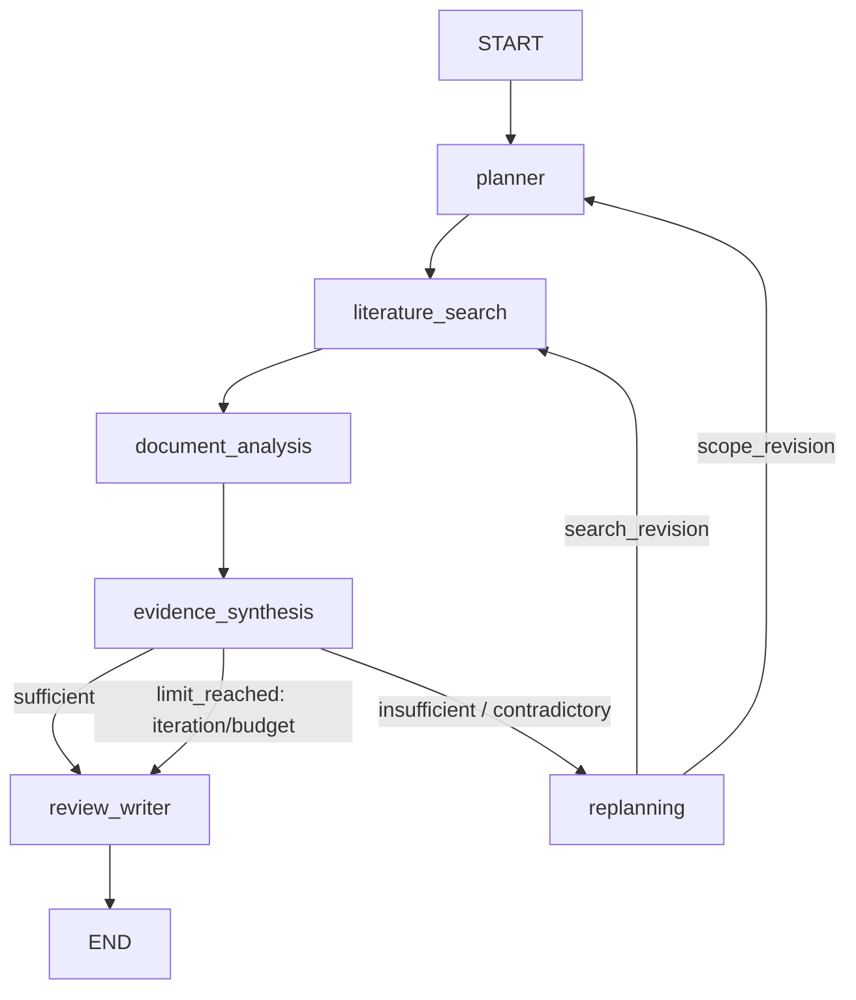

# Phase 6: Multi-Agent System, LangGraph Orchestration and Adaptive Replanning

The five agents live in `backend/app/agents/` and the orchestration in `backend/app/orchestration/`. All LLM calls go through the Phase 4 `LLMGateway`, and all literature and document access goes through the Phase 5 tools. Every step is written to the Phase 4 `TraceRecorder`.

## Agents

| Agent (graph node) | Input | LLM reasoning | Output (typed) | Does not |
|---|---|---|---|---|
| **Research Planner** (`planner`) | `ResearchRequest`, plus the previous plan and a scope-revision `ReplanningRequest` | Objective, 2–6 prioritised sub-questions, keywords, search strategy, inclusion/exclusion criteria | `ResearchPlan` (the version number is set by code) | Search or write |
| **Literature Search** (`literature_search`) | `ResearchPlan`, plus a search-revision `ReplanningRequest`, the IDs of papers already seen and the previous queries | Plans keyword queries per sub-question, refines them once if too few new candidates come back, then screens up to 40 pre-ranked candidates in one batched call | `SearchResults` (+ `SearchRequest` and the selected `Paper`s) | Analyse or write |
| **Document Analysis** (`document_analysis`) | The `CandidatePaper`s selected this iteration, plus their `Paper` metadata | For each paper: methodology, context, findings, limitations and evidence claims with **verbatim quotes** | One `DocumentAnalysis` per paper, with `EvidenceItem`s | Discover or synthesise |
| **Evidence Synthesis** (`evidence_synthesis`) | Plan, all analyses so far, previous verdicts | Agreements and themes, contradictions, gaps, a proposed verdict, a replanning proposal | `SynthesisDecision` + `ReplanningRequest` (when not sufficient) | Search or write |
| **Review Writer** (`review_writer`) | Request, plan, final decision, all evidence, paper metadata, stop reason | Structured review prose with `[@P1]` citations | `FinalReview` | Change the verdict |

Each agent is a separate class with its own prompt, input and output contract. Every agent's LLM output is a Pydantic schema (for example `QueryPlan`, `Screening`, `PaperExtraction`, `SynthesisDraft`, `ReviewDraft`). Code then turns it into the Phase 4 contract and enforces what must be exact:
- quote grounding
- coverage counts
- plan versions
- citation keys
- references, which are built from metadata and never written by the LLM

## Graph

`build_research_graph(runtime)` compiles a LangGraph `StateGraph(ResearchState)`. The conditional edges read the `route` that the previous node computed and already traced. `route_after_synthesis()` and `route_after_replanning()` are pure functions, so they can be unit-tested directly.

## Adaptive loop and validation

1. Synthesis computes **coverage deterministically** (`compute_coverage`). Per sub-question it counts distinct papers with evidence and how many of those were full text: covered means ≥ 2 papers including ≥ 1 full text, weak means fewer, missing means none.
2. The LLM proposes a verdict. **`validate_verdict()`** applies `SufficiencyRules`:
   - ≥ 2 papers with evidence
   - ≥ 3 evidence items
   - every priority-1 sub-question covered
   - no missing sub-question
   - no unresolved contradiction on a priority-1 sub-question

   It accepts the verdict or overrides it. An override keeps the LLM's verdict in `validator_override.original_verdict` and is traced as a `validation` event with `override` set and status `warning`.
3. When the verdict is not sufficient, a `ReplanningRequest` is built:
   - Its reasons are derived from the validated decision (gaps, low quality, contradictions), so `check_against()` always holds.
   - The kind and directives come from the LLM. Code guarantees at least one directive per reason, and a scope revision without a `scope_change` becomes a search revision.
4. Routing: sufficient → writer. Otherwise, below `max_iterations` (3) and with budget left → replanning; else **limit_reached** → writer, with `stop_reason` set to `iteration_limit` or `budget_limit`.
5. The `replanning` node increments the iteration and records a `replan` event. A search revision goes to Search, whose directive queries run first and whose already-seen papers are excluded. A scope revision goes to the Planner (plan v+1 with a `revision_reason`).
6. The Writer marks the review `limited` or `contradictory` and always lists system limitations: the iteration or budget stop, weak or missing sub-questions, unresolved contradictions, and abstract-only evidence.

## Bounds (`ResearchLimits`)

- 3 iterations.
- Per iteration: 6 papers, ≤ 6 search tool calls, and ≤ 3 search LLM steps (query plan, 1 refinement, screening).
- 15 papers per run.
- Analysis concurrency 2, with a 16k-character excerpt per paper and one grounding retry.
- LLM budget of 60 calls / 200k tokens, with 4 calls reserved for the Writer. Before starting another iteration, the router checks it can afford one.
- LangGraph `recursion_limit` 40 (the longest legal path is 15 steps: 4 + 2 × 5 + the Writer).
- 20-minute run timeout.

Phase 4 retry and repair limits still apply to every LLM call. The provider fallback goes through at most 3 candidates and is traced as `fallback`.

## State and secrets

`ResearchState` (a TypedDict with LangGraph reducers) holds only research data:
- request, iteration, plan
- append-only histories of plans, searches, analyses, decisions and replans
- the papers seen, the route, the stop reason, the review, the status and the errors

The gateway (which can decrypt keys on demand), the tools and the recorder are bound to the nodes through `ResearchRuntime`, never through state. `test_research_secrets.py` runs the full graph with a real encrypted Groq key and the real adapter, over a mock transport. It checks that the key reaches the provider's `Authorization` header and is absent from the pickled state and every trace row.

## Failure handling

- **One paper fails:**
  - a missing or malformed PDF becomes abstract-only through Phase 5
  - a paper with no abstract becomes metadata-only, with no LLM call
  - an LLM failure on one paper becomes an `AgentFailure` plus an `error` event, and the other papers continue
- **One source down:** the search is marked degraded. If every query fails, `LiteratureUnavailable` is fatal.
- **Fatal errors** (no provider configured, auth failure, planner or synthesis failure, budget exhausted) produce an `error` event, a failed `agent_completed`, and a final state of `failed`, or `partial` if a synthesis already exists. `run_research()` never raises for agent or tool failures.

## Trace model

Every node emits `agent_started`, then its own `llm_call`, `tool_call`, `validation` and `decision` events (each with `parent_id` = the start event), then `agent_completed` and a `handoff` naming the next node. The orchestrator also records `run_started` and `run_completed`, the routing `decision` (writer, replanning or limit_reached) and `replan` (search or scope revision).

The trace's agent values are planner, search, analysis, synthesis, writer and orchestrator (the replanning node and routing). Messages and handoffs use the node names.

## Tests

The tests use no network and no keys:
- the real graph, agents, Phase 5 tools (search service, dedupe, ranking, SSRF-safe fetcher, pypdf on a local fixture PDF), and the real trace recorder on Postgres
- a schema-routed `ScriptedLLM` (`tests/agent_fakes.py`) for deterministic replies
- **Graph** (`test_research_graph.py`):
  - the sufficient path
  - **insufficient → search revision → sufficient** (the full agent order, iterations, verdicts, routes, handoffs and the revised queries are all checked against the trace)
  - **contradictory → scope revision → Planner v2**
  - iteration limit → Writer with limitations
  - a validator override that keeps the loop going
  - a failing paper
  - a fatal error
  - trace sequence and parenting
- **Agents** (`test_agents.py`): each agent on its own, the validator matrix, the coverage rule and routing.

Mutation checks confirmed the tests fail if routing never replans, the validator never overrides, or Search ignores the directives.
